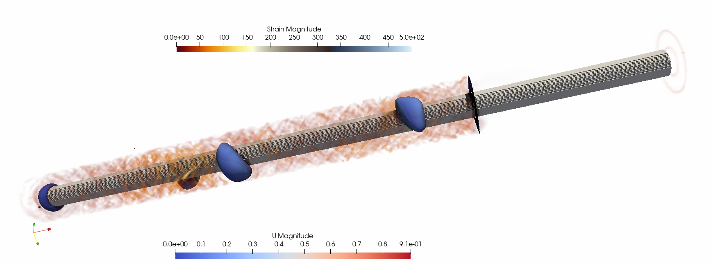

Hydrogen is an essential component in overcoming the energy-environment-climate nexus, supplying a low-to-zero-emissions option for transportation, industrial processes, heating, energy storage, and electricity generation. Currently, the global demand for hydrogen exceeds 90 million tonnes with almost half of this for the production of ammonia, a critical component of agricultural fertilizer. The supply is primarily met through steam methane reforming, which combines natural gas, steam, and a catalyst material at high temperatures. The issue with this process is that it produces ~9kg of CO2 for every kg of H2. This level of CO2 production completely eliminates the benefits associated with hydrogen as a fuel source. To meet global climate targets, significant interest has been placed on green hydrogen production by splitting water into hydrogen and oxygen (electrolysis). However, this process contributed only a fraction of a percent to hydrogen production in 2021 due to the high cost and material demands of electrolysers as well as the significant electricity requirements needed to drive the reaction. This project seeks a solution to producing clean, cost-competitive hydrogen by bridging the gap between laboratory and commercial-scale production of turquoise hydrogen in novel molten-salt bubble reactors.

The aim of the project is to enable large-scale reactor design by numerically investigating the detailed hydrodynamics and chemical kinetics involved in the methane pyrolysis reaction that produces hydrogen in these systems. The process of methane pyrolysis has been around for many years to produce valuable carbon products but has recently gained further interest for its ability to produce H2 without any CO2 by-product. The expected outcome of this project is to develop an advanced modelling framework to optimise reactor design and operating conditions for low emissions hydrogen generation. The research will provide valuable insights into the production of turquoise hydrogen and greatly contribute to the development of sustainable hydrogen production processes.

Students with experience in numerical modelling and a keen interest in computational fluid dynamics are encouraged to apply. Knowledge of lattice Boltzmann techniques and high performance computing is also of benefit but is not necessarily essential. 

Contact t.mitchell@uq.edu.au if you are interested.

